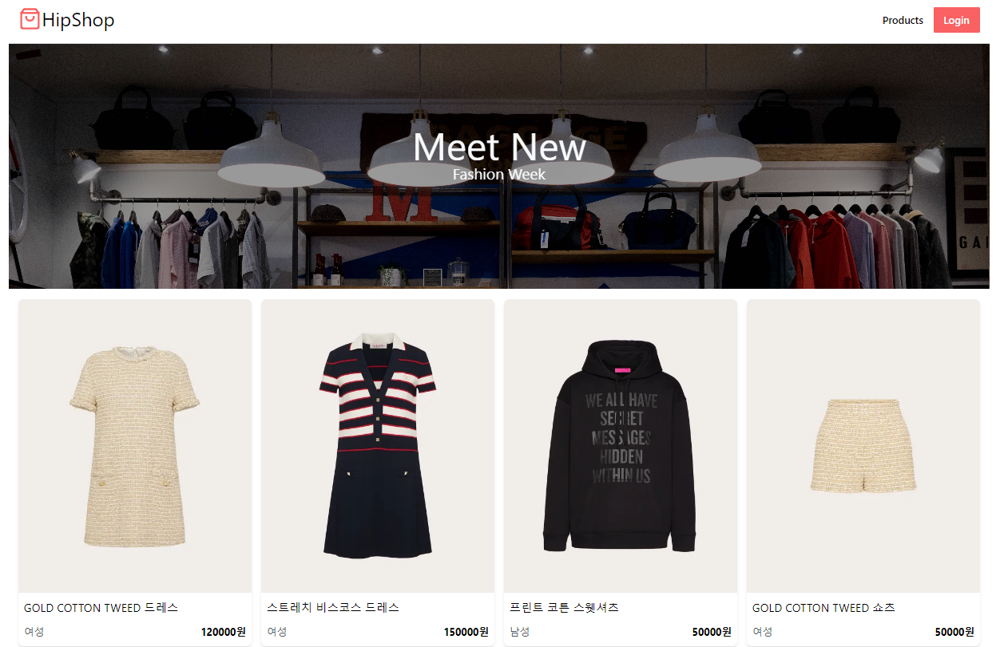

# 🛒 쇼핑몰 프로젝트

 

**프로젝트 기간** : 2023.03.07 ~ 2023.03.16

[🎬 시연 영상](https://www.youtube.com/watch?v=bfjyOJA4VfM&list=PLLA6JaYYILepez63_Ra4ikVFJsR7a2LLt)
 
 

## ****✨ 프로젝트 개요****

- 개인 쇼핑몰 홈페이지
- 어드민 계정으로 홈페이지 관리

 

## ****💻 기술 스택****

### Frontend
    

### Backend

 

|구분|사용 기술|
|:---:|:---:|
|UI|React|
|라우팅|React Router Dom|
|스타일링|TailWind CSS|
|아이콘|react-icons|
|DB|Firebase Realtime|
|서버 상태 관리|React Query|

 

## ****🔍 주요 기능****
- 소셜 로그인(구글)
- 전체 상품 조회
- admin 계정 상품 등록 기능
- 장바구니 상품 추가/삭제/총액계산 기능

 

## ****⚙ 구현 기능****
**로그인**
- 소셜로그인(구글)

**헤더**
- admin 로그인시 네비게이션 다르게 노출

**메인**
- 전체 상품 조회

**상품 상세**
- 상품 옵션 선택
- 장바구니 추가기능

**상품 등록**
- admin 계정 상품 등록기능

**장바구니**
- 장바구니에 추가한 상품들 보여주기
- 장바구니 상품 총액 계산
- 장바구니 상품 삭제, 개수 추가 감소 기능
